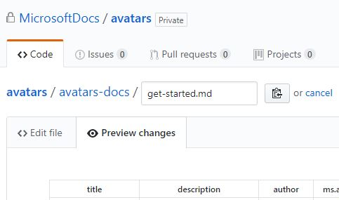

# Contributing to the Avatars documentation

Thank you for your interest in our documentation. We appreciate your feedback, edits, additions and help with improving our docs. This page covers the basic steps and guidelines for contributing.

> [!IMPORTANT] 
> All repositories that publish to docs.microsoft.com have adopted the [Microsoft Open Source Code of Conduct](https://opensource.microsoft.com/codeofconduct/). For more information see the [Code of Conduct FAQ](https://opensource.microsoft.com/codeofconduct/faq/) or contact [opencode@microsoft.com](mailto:opencode@microsoft.com) with any questions or comments.  
>
> Minor corrections or clarifications to documentation and code examples in public repositories are covered by the [docs.microsoft.com Terms of Use](https://docs.microsoft.com/legal/termsofuse). New or significant changes will generate a comment in the pull request asking you to submit an online Contribution License Agreement (CLA) if you are not an employee of Microsoft. We need you to complete the online form before we can accept your pull request.

## How to make a change

| To suggest a change to the docs, follow these steps: |  |
| ------------------- | -------- |
| 1. If you're viewing a Docs.microsoft.com page, click the **Edit** button in the upper right of the page.  You will be redirected to the corresponding Markdown source file in the [GitHub repository](https://github.com/MicrosoftDocs/avatars). |  |
| 2. If you don't already have a GitHub account, click **Sign Up** in the upper right and create a new account. | |
| 3. On the corresponding GitHub page that opens, click Edit (the pencil icon). | |
| 4. In the Edit file pane, use Markdown language to make changes to the content. ([How to write markdown.](https://help.github.com/articles/basic-writing-and-formatting-syntax/))| |
| 5. Click Preview changes to verify the formatting looks as expected. | |
| 6. When you're done, scroll to the bottom of the page where you will see one of the follow:   **Propose file change** - displays when you have read-only access, a forked "patch" branch will be created. After you click "Propose file change", you will be presented with a "Comparing changes" page, allowing you to verify your changes. Then click the "Create pull request" button to submit your changes. At this point you are finished! | |
| If you have been granted special permission for this content, step #6 may look like this instead: **Commit changes** - giving you two options for saving your changes: **"Commit directly to the `<branch-name>` branch"**, where `<branch-name>` is the name of the branch you were on when you clicked the "Edit" button. This applies your changes directly to the branch instead of using a pull request. At this point you are finished! |  |

After you submit changes (via a pull request), they will be reviewed by a member of the documentation team. If your request is accepted, updates are published to [https://docs.microsoft.com/avatars](https://docs.microsoft.com/avatars).

*For internal review only, you can see your changes at [https://review.docs.microsoft.com/avatars](https://review.docs.microsoft.com/en-us/avatars/?branch=master).

## Working with Branches

The [Avatars GitHub repository](https://github.com/MicrosoftDocs/avatars) utilizes two main parent branches: [Master](https://github.com/MicrosoftDocs/avatars/tree/master), this content can be reviewed on the [staging site](https://review.docs.microsoft.com/avatars), and [Live](https://github.com/MicrosoftDocs/avatars/tree/live), for content appearing on the [live site](https://docs.microsoft.com/avatars). 

When making contributions, please submit your Pull Request (PR) to the **Master** branch. This branch can be viewed on the staging site and should only contain contributions that are ready to be published live. You may also create and submit a branch with your own unique branch name which can be selected and viewed in the staging site. (The **Live** branch is only allowed for use by the content administrators.)

## Using issues to provide feedback on Avatars documentation

To provide feedback, or point out a problem, rather than directly modifying actual documentation pages, [create an issue](https://github.com/MicrosoftDocs/avatars/issues) and the content owners will do their best to address the issue in a timely fashion.

Be sure to include the topic title and the URL if you are creating an issue regarding a specific page.

Thank you for supporting this content!
