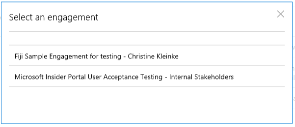
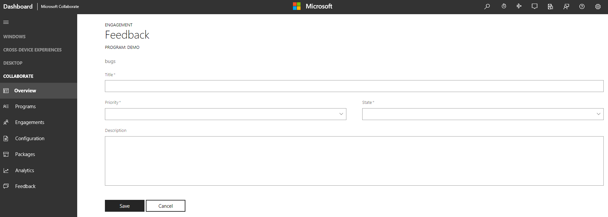

# Submit and Modify

## How to submit new feedback

When you want to submit new feedback, you first select an engagement to associate with the feedback. Each work item must be associated with only one engagement because the engagement and work item type determine which form to use and which organization in Microsoft to sync the feedback to.

1. Choose one of the multiple ways to create new feedback:
 - From the **MS Collaborate Dashboard**, click "Add New" under the Feedback item.
 - From the **All Feedback** list page, select "Submit New Feedback".
 - From an **Engagement** page, select "New" next to the specific work item type.

2. Select the appropriate Engagement for the work item.

   

3. The “Submit Feedback” page will appear. Complete the required fields and click “Save”.

   

> Fields on the **Submit Feedback** page are dependent on the Engagement selected. Engagements can customize the feedback forms as needed.
 
4. Clicking **Save** will take you to the **Feedback List** view. Work items submitted will appear on this page. 

> [!NOTE]
> **Prerequisites**: 
> * User must belong to at least one engagement. 
> * Engagement owner must enable feedback for the engagement.

## How to update feedback

1. Open a work item from any of the **Feedback List** pages. The **Edit Feedback** page will appear. You can edit any available fields depending on the state of the work item and the rules established for the engagement.

2. Saving the work item will sync changes for all organizations in the Engagement.

## How to assign feedback to others

When you are working with feedback work items in MS Collaborate, you can assign a work item to specific users in your organization, to a Microsoft feature team or division, or to another organization who is part of a multi-party engagement.

When you log into MS Collaborate, the system knows which organization you belong to.  This enables the feedback forms to populate user information for your organization.

New work items that are available for your organization to triage and assign typically have Assigned to = Active.  Note: engagement owners can customize the forms, so the exact functionality depends on how your engagement owner configured the forms.

When you select a people-based drop-down, you will see the name of the users in your organizations and of the other organization name(s).  Note that any named organizations can see the work items.

A work item assigned to you means it is your responsible to take action on the work item.

**To assign a work item to Microsoft**, select the Microsoft organization in the Assigned to field.
