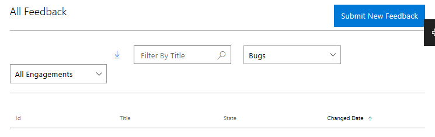
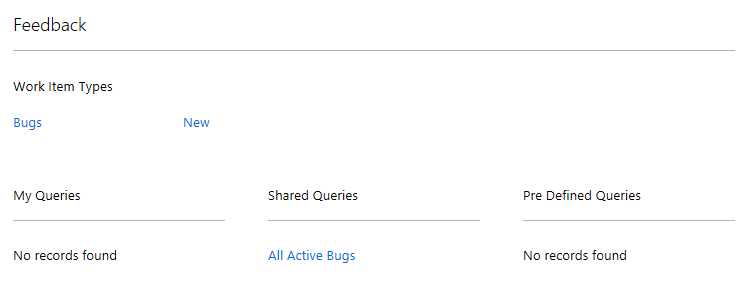
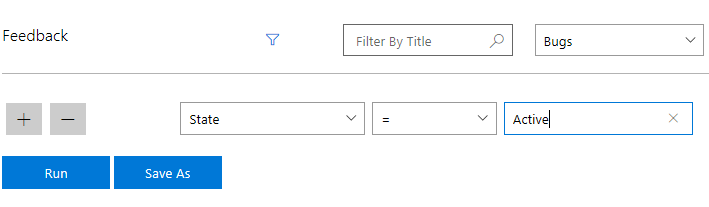
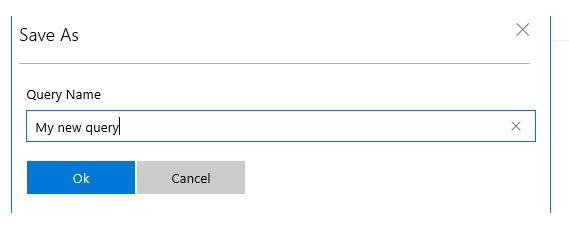
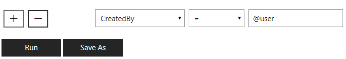

# Search and Queries

## Search

On the [All Feedback page](//developer.microsoft.com/dashboard/collaborate/feedback/bugs) in the MS Collaborate portal, you can see all work items for the engagements you have access to.  You can filter the page for specific feedback in the following ways:
-  Sort individual columns in the feedback table.
-  Select specific engagements.
-  Filter by **Title**.
-  Filter by **Work item type**.

## Types of queries

The Feedback system in MS Collaborate has different types of saved queries.  Feedback queries are an easy way to find work items that meet the criteria you define.  You simply click on the query link and the results list will appear.  You can also save edits to an existing query or use **save as** to create a new query with a new name.

You can use use the following types of queries for an engagement or program:
- **My Queries** are created by you and are visible only to you. This is a private query.
- **Shared Queries** are created by program and engagement owners. These queries are visible to all users within an engagement.
- **Pre-Defined Queries** are managed by the MS Collaborate team.  Contact your engagement owners to recommend changes.

You can open any existing query and use the **Save As** option to save it to your **My Queries** list or to create a new query from the existing one.

## How to create queries

To create queries, you must be within the context of a specific engagement.  

1. Navigate to an Engagement and click on one of the options within the Engagement page to get to the list of feedback that you want in the query.

   

2. Click the **Advanced Filter** icon to see the fields that you can use to define the query. 

   

3. Click **Run** to return the desired query results, you can click **Save As** to add the query.

   

4. To **Edit** an existing query, navigate to the query, click the **Advanced Filter** icon and then click **Save As** to save the query as a new query.

## How to find feedback submitted by you

1. Navigate to an Engagement and click on one of the options within the Engagement page to get to the list of feedback that you want in the query.

2. Click the **Advanced Filter** icon to see the fields that you can use to define the query.

3. Click the '**+**' button to add new filter. Select **CreatedBy** from list of available fields.

4. Type <strong>@user</strong> in the textbox.

5. Click **Run** to return the desired query results.

   
  
  
