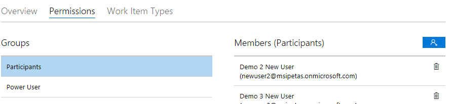
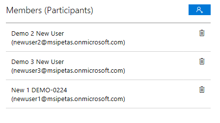

# How permissions work
The Microsoft Collaborate system uses **Engagements** to define the permissions/roles for the portal.  Very simply, if you are a member of the engagement, you see the engagement metadata, content and feedback associated with the engagement.  If you are not a member of the engaement, you do not see the engagement or any of its artifacts.

MS Collaborate has the following membership roles:

Role | Scope of permissions | Description
---------------- | ------------------- | ---------------------------------
Participants | Engagement | Users of the content and feedback associated with the engagement. Able to view engagement information and the Program landing page the engagement is part of.  Able to download content.  Able to view, edit feedback work items associated with the engagement.
Power User | Engagement | Organization admins who are able to manage users for their organization.  An organization can have multiple Power Users identified.  Power Users can add other users to the Power User role for the engagement.
Content Publisher | Engagement or Program | User able to publish content packages to be downloaded by participants.  Program-level Content Publishers can publish to all engagements under the Program.  Engagement-level Content Publishers can only publish the the specific engagement.  
Enagement Owner | Engagement | Microsoft users able to manage the engagement, including engaement metadata, membership, feedback forms, and publishing templates.  Engagement owners also inherit all other role permissions within the engagement, such as package publishing and participant user permissions.
Program Owner | Program | Microsoft users who can manage the program and all engagements under the program.  Program owners can choose which Microsoft users are enabled to create engagements under the program.

# Managing User Memberships

Your Microsoft engagement owners will configure the engagements in MS Collaborate and users will be invited to participate in the engagement.

Adding users to an engagement requires that each user is registered in the Dev Center.  If the user is a member of a company or organization, the Dev Center admin needs to add the new users to the Dev Center company account before they can be added to an MS Collaborate engagement.  

Once a user is registered in Dev Center, it it easy for an MS Collaborate *Engagement Owner(s)* or organization's *Power User(s)* to a add the user to an engagement.  Engagement Owners can add Power Users for an organization.  Contact the MS Collaborate Engagement Owner to be added as a Power User for your organization.

> [!NOTE]
> If your organization uses Azure Active Directory (AAD) in Dev Center, you need to onboard the users to Dev Center in your AAD account.

## How to add/remove organization users

1. Navigate to the Engagement in which you want to add or remove users and click **Edit Engagement** to open the Engagement management page. As an organization Power User, you can only change membership roles for users in your organization.  All other tabs will be read only.

2. Click on the **Membership** tab and select the **Group** that you want to manage.
	a. Participants can interact with the engagement artifacts (feedback, packages).
	b. Power Users can add or remove users.
	c. Note that *Power Users* need to be explicitly added as *Participants* if the the user also needs to access the feedback and content for the engagement.

3.	Click the **Add User** icon in the **Members** section to launch the **Add a User** page.

4. In the **Search Users** dialog, search for the user(s) you would like to add. Select the users you want to add to the engagement. You can also use **Select All**.
	a. Power Users can only search for users in your own organization.  For Engagement Owners, the list may be limited to the organizations identified as parties in the engagement.
	b. If the users are not appearing in the search, the first thing to check is whether the user has been added to your organization’s Azure Active Directory in Dev Center.  If not, first have the Dev Center organization admin add the user to the MS Collaborate program.
	c. It is possible that your organization has more than one Dev Center organization account (seller Id) in Dev Center.  Be sure the appropriate organization has been added to the engagement and that the appropriate users are in that organization.  If the organization is incorrect, please contact your Microsoft Engagement Owner.

5.	To remove a user, select the user in the Members list and click the delete icon.
 
 

6.	Confirm that you want to remove the user, and the user will no longer be in the list.

