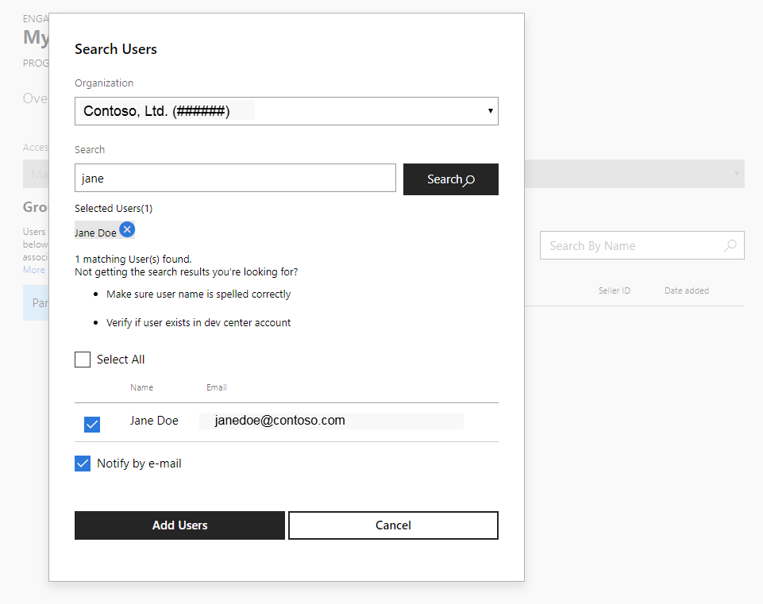

# Access Management

## Overview 

What a user can do within the portal is defined by the *engagements* and *groups* they belong to. If user is a *participant*, they can see the engagement metadata, content and feedback associated with the engagement. Additional permissions can be granted through other groups. 

At this time, only Microsoft users can manage programs and engagements. Non-Microsoft users can use join existing engagements and manage user access for their organization.

## Groups

The following groups exist in the portal:

| Group | Scope of permissions | Description | Permissions |
---------------- | ------------------- | ------------------------ | ---------------------------- |
| Participant | Engagement | Regular engagement users | View engagement and program overview, download content, view and modify existing feedback, submit new feedback |
| Power User | Engagement | Advanced users who manage access for their organization | Add and remove participants for their organization |
| Content Publisher | Engagement | Microsoft users who publish content | Publish content |
| Engagement Owner | Engagement | Microsoft users who manage existing engagements | Manage all aspects of the engagement |
| Engagement Manager | Program  | Microsoft users who create new engagements | Create new engagaments under specific program | 
| Program Owner | Program | Microsoft users who manage programs | Manage all aspects of the program and all engagements under the program | 

## Managing users

Only users that exist in a Partner Center account can be added to engagements. If a company or an organization does not have an account in Partner Center, their representative needs to create an account and identify an organization admin who can add other users. 

See [Register with Microsoft Collaborate](registration.md) for more information about creating an account in Partner Center.

> [!NOTE]
> Collaborate uses the same account as other programs in Partner Center.  The type of account you choose is important if your company or organization plans to enroll in other Partner Center programs that require bank account or certificate information.  
> 
> If your organization uses Azure Active Directory (AAD), you need to add users from AAD tenant to the Partner Center account before they can join an engagement.
> 
> If you belong to multiple Partner Center accounts, be sure to use Collaborate with the one your organization used for Collaborate onboarding.  

### How to add a participant

Once a user is added to a Partner Center account, *Power User(s)* delegated by the organization can add them to engagements. *Power User(s)* can only manage *Participant(s)* group for their organization. *Power User(s)* cannot add or remove other *Power User(s)*. 

1. Find the engagement you want to add participant to and click **Manage Membership**. 

2. Click on the **Membership** tab and select the *Participant* group.

	

3. Click the **Add** button under **Members (Participant)**. 

4. Search dialog will open. Enter name of the user or e-mail address click **Search** button. You can also search using partial match.

	

4. Select the users you want to add to the engagement. You can also use **Select All** option.

5. Select if you want to send an invitation mail to the user(s) with engagement link.

Once added to the *Partcipant* group, users can download content and submit feedback (if engagement is configured to accept feedback).

### How to remove a participant

1. To remove a user, select their name in the list and click the delete  icon.
 
2. Confirm that you want to remove the user, and they will no longer be a member of the group.

Note that removing a user from an engagement does not impact the user's account in the Partner Center account system.  The user account will remain available for other engagements and other Partner Center programs.

### How to add a power user

Only *Engagement Owners* can add *Power Users* for an organization. Reach out to your Microsoft contact to inform them who will manage access for you organization and they will add them to the *Power User* group. 

### If a user is missing from search results

An organization's *Power Users* can only search for users within their own organization's Partner Center account. 

If a user does not appear in search results:
- verify if they are added to the organization’s account in Partner Center. If not, work with the **Administrator** of your organization account to add missing users. See [Add users to your Partner Center account](https://docs.microsoft.com/en-us/windows/uwp/publish/add-users-groups-and-azure-ad-applications#add-users-to-your-dev-center-account) article for the detailed instructions.
- It is possible that the organization has more than one Partner Center organization account (seller ID) in Partner Center. Verify that correct organization is used. If incorrect organization is used, reach out to your Microsoft contact.
	
### How to export list of partcipants to a file

1. Select the *Participant* group.

2. Click **Export** button. 

3. Save the file to local disk.

### How to copy participants from other engagement

1. Select the *Participant* group.

2. Click **Copy** button. 

3. Type name of the engagement you want to copy users from and click **Search** button.

4. Select users from the list and click **Add Users** button.

