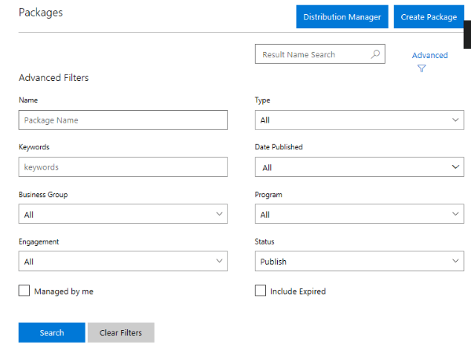
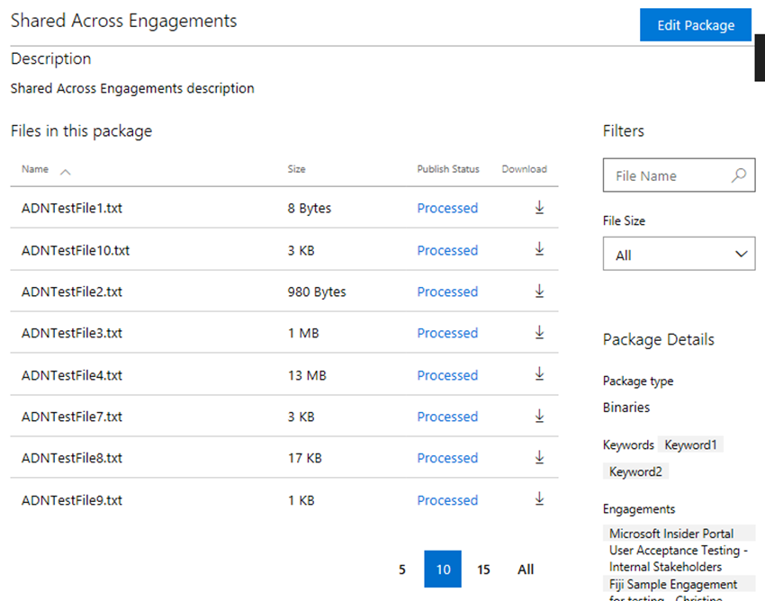
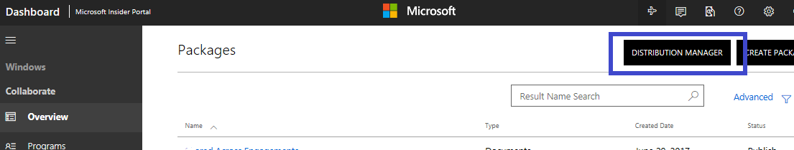
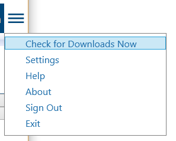
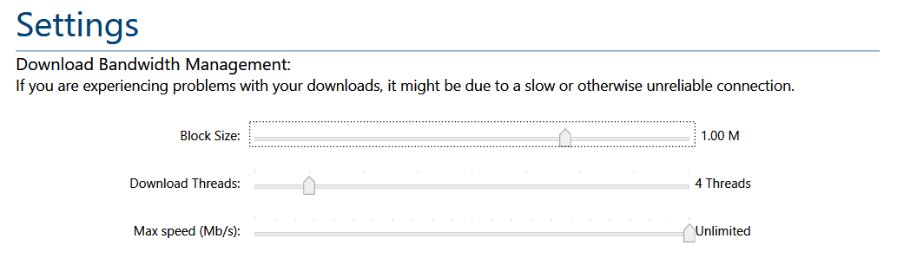

# Working with Packages to Download Content

In Microsoft Collaborate (MS Collaborate), downloadable content is available as *Packages* that contain the files to download.  Packages have metadata associated with them to facilitate finding the right packages, such as a description, package type, publish date,  and keywords.   

Which packages you can download depends on the engagements you belong to.  During publishing, Content Publishers target specific engagements for the package. If you are a participant member of an engagement, you will be able to see the packages for that engagement.  This means users can only see packages associated with engagements they belong to.

MS Collaborate provides two mechanisms for downloading content packages:
1. MS Collaborate **Packages page on the portal** enables you to find packages and download individual files from a package. 
2. MS Collaborate **Distribution Manager** can be installed on your local machine to download multiple files and packages at once.

Regardless of the download mechanism used, users will see the same packages in the portal as in the Distribution Manager.

Content Publisher is a permissions role in MS Collaborate associated with engagements.  At this time, only Microsoft users can publish to engagements. Engagement Owners define which users have Content Publisher permissions.

## Finding Packages in the MS Collaborate portal

On the **Packages** page, you can filter and search for packages based on multiple criteria, including:
- words in the name, 
- the Program or Engagement that the package belongs to, 
- when the package was published, 
- the type of files in the package, and
- by using keywords.

For example, if you are looking for a specific Windows Build package and you know the build number, you could enter it as a filter. Each filter box is cumulative, so you can start with fewer filters and add more to limit the number of packages returned until you find what you are looking for. You can also sort the list of packages by column to help with locating packages.

The Distribution Manager has basic search/sort capabilities, but the portal provides a richer search/filter experience.  If you have many packages available to you, it is recommended that you use the portal's search to find the right package, and then search on the package name in the Distribution Manager.

## How to download files from the MS Collaborate portal

1. From the Dashboard, click on "Packages" to get to the **Packages** page, where you will see a list of all packages available to download.

2. Search or use **Advanced Filters** to find the package you would like to download. The filters are cumulative to help narrow the search. Use the "Clear Filters" button to remove all filters.
	- Click the **Advanced Filters** icon to toggle display of the Advanced Filter" fields.
	
3. When you locate the package you want to download, click on it to open the package. You will find all of the details about the package and a list of files available to download.
	

4. Click on each file to initiate the download. In the MS Collaborate portal you can download one file at a time. 

## Using Distribution Manager for multi-file downloads

If you want to download a whole packages with multiple files or large packages, we recommend installing the **Distribution Manager**.  The Distribution Manager is a ClickOnce client application that will update as required.  

This client application connects to MS Collaborate services using the same credentials you use to log in to the MS Collaborate portal. All of the same packages you can see on the MS Collaborate portal will appear in the Distribution Manager.

In addition to downloading multiple files at once, you can queue many packages to run in the background and you can also customize download settings to address connection issues.

### How to install the Distribution Manager

From the **Packages** page, click the **Download Distribution Manager** button at the top of the page. 
	

If you are already logged into Dev Center, when you click the Distributuion Manager button, the Distribution Manager will launch and sign you in with the same account you used to log in to MS Collaborate.

### How to log in to Distribution Manager

Distribution Manager uses the same account you use for MS Collaborate.  If you launch it from the MS Collaborfate portal, you will be logged in automatically.  If you are not already logged into MS Collaborate, or if you are using an MSA account to access the site, you may need to log in to the Distribution Manager again. This will be using the same account and process you used to log into the MS Collaborate portal.

1.	Launch the Distribution Manager application on your computer by selecting the **Distribution Manager** button on the **Packages** page in the MS Collaborate portal OR by navigating to **Distribution Manager** in your computer’s list of applications.

2.	You will see the same log in screen you see when you log into Dev Center or MS Collaborate. Select the appropriate account, enter your password, and Distribution Manager will connect to your MS Collaborate account.

### How to download packages using Distribution Manager

1.	In the Distribution Manager, search for packages using the search functionality or by scrolling through your package list.
2.	You can select multiple files within a package, or multiple packages to download.  Up to four packages can download at a time.
3.	You can select the folder you would like to download using the **Browse** button.
4.	Click **Download** to initiate the downloading of the selected packages.
5.	Icons update to indicate the status for packages that are queued for download.

You will see the files that are **Downloading Now** as well as packages that are queued for download.  You can click **Download Now** to see just the files that are downloading.  

You can also navigate to **Check for Downloads Now** from the Menu in Distribution Manager.

   

> [!NOTE]
> - You can **pause downloading** and then resume to continue downloading.
> - You can force a sync of Distribution Manager, by clicking the menu item and then selecting **Check for Downloads Now**.
> - Clicking on **Settings** from the Menu allows you to make customizations. 

### Customizing Distribution Manager Settings

In Distribution Manager, you can access **Settings** from the menu near your log in name.  Distribution Manager settings are intended to enable you to customize how packages get downloaded.  You can adjust the following settings:
- Block Size, 
- Download Threads, and
- Max speeds.

It is recommended that you only change these if you are experiencing problems with downloading that might be due to a slow or unreliable connection.

## Notification

Users can configure preferred e-mail address and choose which types of notifications to receive for new packages or contents update.

1. Click on the  **Settings** icon in the upper right corner and select [**My preferences**](https://partner.microsoft.com/dashboard/v2/action-center/mypreferences) from the drop down menu.
2. Verify that **Preferred e-mail address** is correct. Change if needed.
