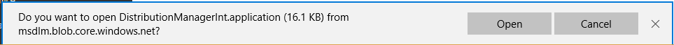
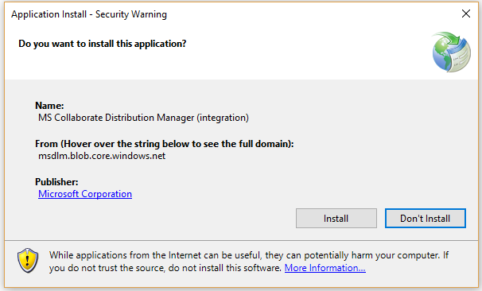

# Working with Package Downloads

The Microsoft Collaborate (MS Collaborate) portal enables you to find packages and download individual files. Packages available for download are associated with one or more Engagements.  You can only see packages associated with Engagements you belong to.

### Filtering Packages

The **Packages** page can be filtered based on multiple criteria, including:
- words in the name, 
- the Program or Engagement that the package belongs to, 
- when the package was published, 
- the type of files in the package, and
- by using keywords.

For example, if you are looking for a specific Windows Build package and you know the build number, you could enter it as a filter. Each filter box is cumulative, so you can start with fewer filters and add more to limit the number of packages returned until you find what you are looking for. You can also sort the list of packages by column to help with locating packages.

## How to download files using the MS Collaborate portal

1. From the Dashboard, click on "Packages" to get to the **Packages** page, where you will see a list of all packages available to download.

2. Search or use "Advanced Filters" to find the file you would like to download. The filters are cumulative to help narrow the search. Use the "Clear Filters" button to remove all filters.
- Click the "Advanced Filters" icon to toggle display of the "Advanced Filters" fields.

3. When you locate the package you want to download, click on it to open the package. You will find all of the details about the package and a list of files available to download.

4. In the MS Collaborate interface, you can only download one file at a time. Click on a file to initiate the download. 

### Distribution Manager for multi-file downloads

If you want to download packages with multiple files or large packages, we recommend installing the **Distribution Manager**. This client application connects using the same credentials you use to log in to the MS Collaborate portal. All of the same packages you can see on MS Collaborate will appear in the Distribution Manager.

### How to install the Distribution Manager

1.	From the **Packages** page, click the "Distribution Manager" button at the top of the page.

2.	Click "Open" on the message.

3.	Click "Install" in the Application Install dialog box.
 
 

4.	If you are already logged into Dev Center, the Distribution Manager will launch and sign you in.

### How to log in to Distribution Manager

If you are not already logged into MS Collaborate, or if you are using an MSA account to access the site, you may need to log in to the Distribution Manager again. This will be using the same account you used to log into the web portal.

1.	Launch the Distribution Manager application on your computer:
- Select the Distribution Manager button on the **Packages** page in the MS Collaborate portal.
- Navigate to Distribution Manager in your computer’s list of applications.

2.	You will see the same log in screen you see when you log into Dev Center or MS Collaborate.

3.	Select the appropriate account, enter your password, and Distribution Manager will connect to your MS Collaborate account.

### How to download packages using Distribution Manager

1.	In the Distribution Manager, search for packages using the search functionality or by scrolling through your package list.
2.	You can select multiple files within a package, or multiple packages.
3.	You can select the folder you would like to download using the "Browse" button.
4.	Click "Download" to initiate the downloading of the selected packages.
5.	Icons update to indicate that packages are queued for download.

You will see the files that are "Downloading Now" as well as packages that are queued for download.

> [!NOTE]
> - You can pause downloading and then reactivate to continue downloading.
> - You can force a sync of Distribution Manager, by clicking the menu item and then selecting "Check for Downloads Now."
> - Clicking on Settings from the Menu allows you to make customizations. 

