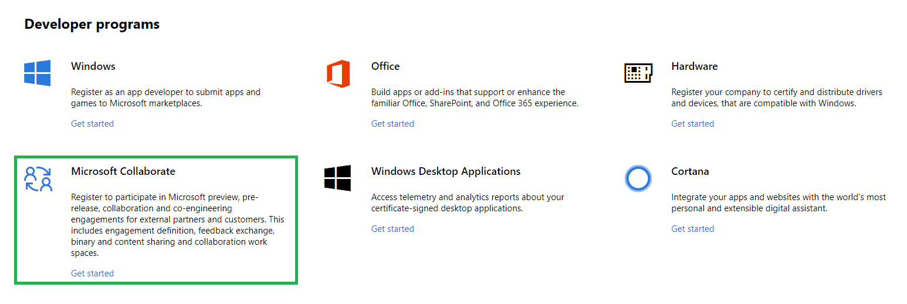
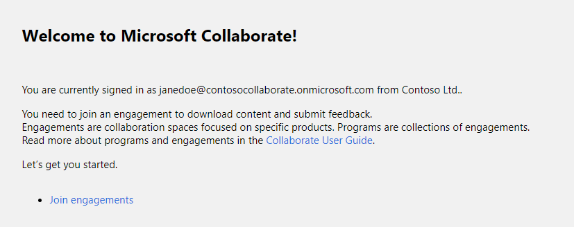
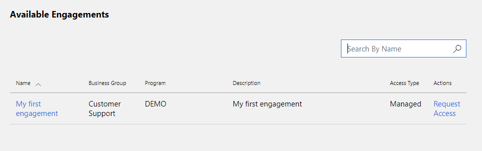
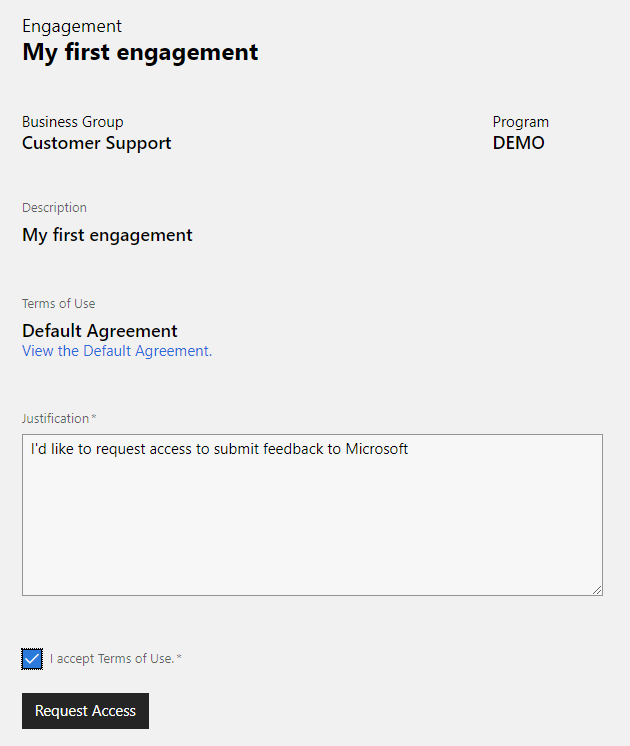

# Registration

Microsoft Collaborate program is offered through Partner Center and requires registration. If you already have an account in Partner Center, it is best to use the same account to enroll in Collaborate. 

 > [!IMPORTANT]
 > You can use one of the following accounts to work in Partner Center:
 > * *Microsoft Account* (personal account)
 > * *Azure AD* (organizational account)
 >
 > Only users with *global administrator* role can register using *Azure AD* account. If you do not have this role, you can try to [find global administrator](troubleshooting.md#how-to-find-global-administrator-for-your-organization) for your organization to help you register.
 
## How to register as an individual

1. Navigate to the [Partner Center Directory](https://partner.microsoft.com/en-us/dashboard/directory).
2. If you're not already signed, sign in now using existing account or create new *Microsoft Account*. 
3. Scroll down to **Developer programs** section and click on [Get Started](https://partner.microsoft.com/en-us/dashboard/registration/collaborate) link for **Microsoft Collaborate**. 

   

4. The **Get Started** link will take you to the registration page. 

   

   > [!NOTE]
   > If you signed in with the existing Partner Center account, the page would contain information from that account. You can modify **Publisher display name** and **Contact info** if needed.
    
   > [!IMPORTANT]
   > The following error indicates that user is signed in with an *Azure AD* account that does not have administrator privileges and registration cannot be completed. 
   > > We could not validate your identity as a global administrator. 
   > 
   > Try to [find global administrator](troubleshooting.md#how-to-find-global-administrator-for-your-organization) for your organization or sign out and sign in again using *Microsoft Account*. 

5. Select the **Account country/region** in which you live, or where your business is located. You won't be able to change this later.
6. Select your **Account type** (individual or company). You won't be able to change this later, so be sure to choose the right type of account.
7. Enter the **Publisher display name** that you wish to use (50 characters or fewer). Select this carefully, as this name will be used when you interact with Collaborate (download content, submit feedback etc.). For company accounts, be sure to use your organization's registered business name or trade name. Note that if you enter a name that someone else has already selected, or if it appears that someone else has the rights to use that name, we will not allow you to use that name. 

   > [!NOTE]
   > Make sure you have the rights to use the name you enter here. If someone else has trademarked or copyrighted the name you picked, your account could be closed. If someone else is using a publisher display name for which you hold the trademark or other legal right, [contact Microsoft](https://go.microsoft.com/fwlink/p/?LinkId=233777).    

8. Enter the contact info you want to use for your account.

   > [!NOTE]
   > We'll use this info to contact you about account-related matters. For example, you'll receive an email confirmation message after you complete your registration.

   If you are registering as a company, you'll also need to enter the name, email address, and phone number of the person who will approve your company's account.

9. Review your account info and confirm that everything is correct. Then, read and accept the terms and conditions of the [Collaborate Agreement](https://go.microsoft.com/fwlink/?linkid=849107). Check the box to indicate you have read and accepted these terms.

10. Click **Finish** to confirm your registration.  

## How to configure access for multiple users
> [!TIP]
> [Partner Center](https://partner.microsoft.com/dashboard) leverages Azure AD for multi-user account access and management. If your organization already uses Office 365 or other business services from Microsoft, you already have Azure AD. Otherwise, you can create a new Azure AD tenant from within Partner Center at no additional charge.

-   [Associate Azure Active Directory with your Partner Center account](/windows/uwp/publish/associate-azure-ad-with-dev-center)
-   [Add users, groups, and Azure AD applications to your Partner Center account](/windows/uwp/publish/add-users-groups-and-azure-ad-applications)
-   [Set roles and custom permissions for account users](/windows/uwp/publish/set-custom-permissions-for-account-users)

## What happens when an Azure AD tenant is linked to a Partner Center account?

* *Tenant ID* is added to the account data
* Account *Administrator* gets the ability to view users of the *Azure AD* tenant and add them to the account
* Tenant *Global Admin* gets the ability to add new tenant users in Partner Center
* Tenant *Global Admin* gets the ability to invite guest users in Partner Center

No changes are made to the *Azure AD* tenant itself.

## How to register as an organization

### Before you begin
To create an account on Partner Center, you’ll need to have on hand the following information. You may want to take a few minutes to gather these items before you get started:

* Global administrator work email. If you're not sure what your company's work account is, see [how to find global administrator](troubleshooting.md#how-to-find-global-administrator-for-your-organization).

* If your company doesn’t have a work account, you can create one during the account creation process.

* Your company’s legal business name, address, and primary contact. We need this information to confirm that your company has an established profile and that you are authorized to act on its behalf.

* Authority to sign legal agreements. Ensure that you are authorized to sign legal agreements on your company's behalf as you’ll be asked to do so during the enrollment process.

* Name and company email of the person you want to act as your primary contact.

### Guidelines
When creating a company account, we suggest that you follow these guidelines, especially if more than one person needs to access the account.

 - Create your Microsoft account using an email address that doesn't already belong to you or another individual, such as *MyCompany_PartnerCenter@outlook.com*. You may not be able to use an email address at your company's domain, especially if your company already uses Azure AD.
 - If you plan to join **Windows** program for app development in future and want to reuse your partner center account, then it is recommended that you enroll to **Windows** program first and then join **Collaborate**. Otherwise you might have to create separate accounts for these programs.
 - Add a company phone number that does not require an extension and is accessible to key team members.

## Next steps

### Navigate to the portal

1. Navigate to the Collaborate homepage: [https://aka.ms/collaborate](https://aka.ms/collaborate).
2.	Sign in using Partner Center account credentials. 
3. If your organization created multiple *Azure AD* tenants, select the one it uses for Collaborate. Click on badge icon on the *right* of the screen to view the list of available tenants. 
4. If your organization opened multiple accounts in Partner Center, select the one it uses for Collaborate. Click on the account name in the *left* navigation menu to view list of account.
5. When authentication is completed, you will see the homepage displaying your name and organization.

> [!TIP]
> Homepage will look different if you participate in at least one engagement - you will see links to resources available to you. 

### Request access

Before you can download content or submit feedback, you need to join an engagement. Depending on how engagement is configured, you can:
* Join
* Request access
* Contact engagement administrators (users with **Engagement Owner** or **Power User** role) using other channels, for example e-mail, and ask them to add you to the engagement. 

> [!TIP]
> **Power User** is a representative from your organization who manages engagement access.  
> Depending on how engagement is configured, owner approval might be required for users to join. Some engagements only require acceptance of terms of use.

1. Click on the *Join engagements* link to browse the list of *new* engagements available to you and your organization.

2. Find the engagement you are interested in and click on its name. Page with detailed engagement information will open.

3. Review *Description* and *Terms of use* to make sure you understand the engagement purpose and terms of use. 
4. Check *I accept Terms of Use* field and click **Join** or **Request Access** button.
5. If owner approval **is not required** (*Join* option), engagement will be added to the engagement list and you can start using it. If you do not see the engagement in the list - press **F5** to refresh the page.
6. If owner approval **is required**, you will be asked to provide justification for requesting access. *Engagement owner* and *Power User* will be notified about access request via e-mail. They will review the request and configure engagement access. Usually they will notify you when access is granted. If you do not receive a notification, review the list of engagements to check if your access request was approved.
