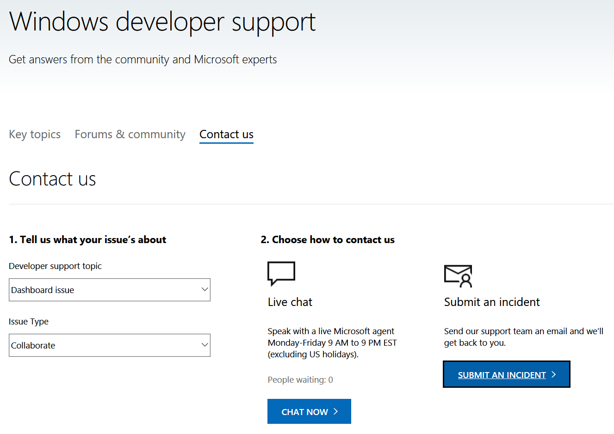

# How to Get Support
This page provides instructions on how to get support with Microsoft Collaborate.

## Support Options
1. If you are not sure how to do something in Microsoft Collaborate, review the [Documentation and Guidance](https://docs.microsoft.com/collaborate/) for the area you have questions about.
2. If your question or issue is related to a specific program or engagement, check their support options first. This information is available on the program and engagement overview pages respectively.
3. If something is not working the way you expect, check the [Troubleshooting Guides](https://docs.microsoft.com/collaborate/troubleshooting) to see if your issue is described.
4. If none of the above answers your question or resolves your issue, contact [Customer Support](https://support.microsoft.com/supportrequestform/83cdfd8d-c24a-fbe4-fb2a-3fead30613a9). 

## Customer Support
  * Navigate to https://aka.ms/dcsupport.
  * **Sign in**  
  * Click **Contact Us**
  * Select **Dashboard Issue** for the **Developer Support Topic** dropdown
  * Select **Collaborate** for the **Issue Type**

>[!NOTE]
>
> You must sign in to chat or to submit an incident. 

### Live Chat

  * Click **Chat Now** under **Choose how to contact us**

### Submit an Incident

  * Click [Submit an Incident](https://support.microsoft.com/supportrequestform/83cdfd8d-c24a-fbe4-fb2a-3fead30613a9) under **Choose how to contact us**
 
 

 

