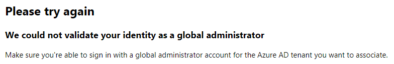
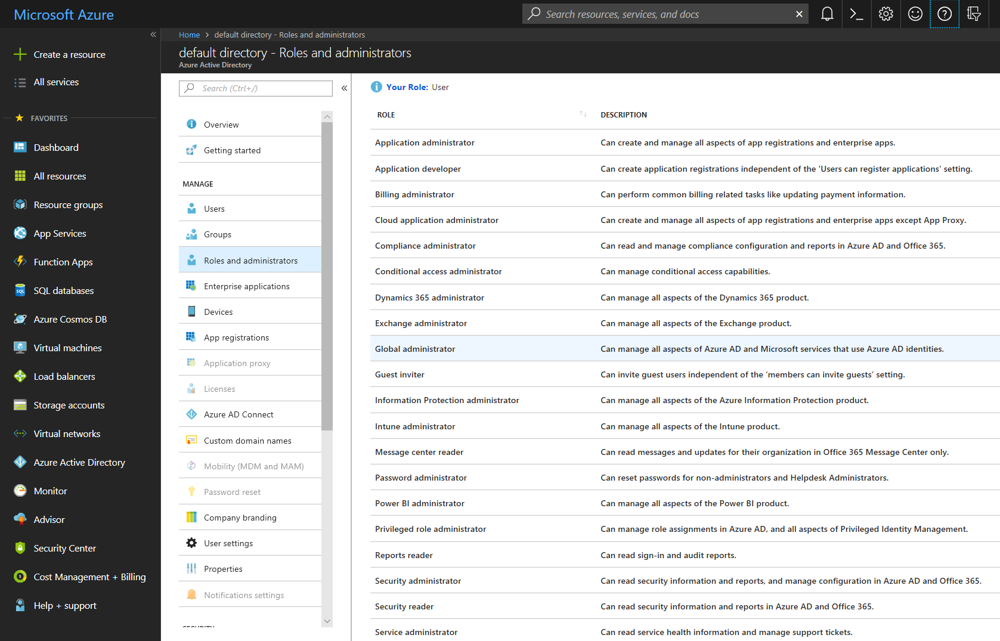

# How to Troubleshoot Common Issues

This page provides troubleshooting guides for common issues.

## Sign-in

### Browser shows "Resources for partners" page when signing in to Partner Center

After navigating to Collaborate dashboard and entering your username and password, you are being redirected to [Resources for partners](https://partner.microsoft.com/dashboard/directory) page.

#### Fixes/Workarounds

##### Change Directory / Account

- click on the badge icon in the upper right corner and select the directory you usually work in
- use account selection control in the left navigation menu to select correct account

##### Clear browsing cache in EDGE

- Open **Settings and more** menu
- Select **Settings**, then **Privacy and security**
- Click on **Choose what to clear** button under **Clear browsing data** section
- Select **Cookies and saved website data** and **Cached data and files** options
- Click **Clear** button.

Read more about [browser cache](https://support.microsoft.com/en-us/help/10607/microsoft-edge-view-delete-browser-history).

##### Clear browsing cache in Chrome

- Open **Customize and control Google Chrome** menu
- Select **More tools**, then **Clear browsing data...**
- Select **Cookies and other site data** and **Cached images and files** options
- Click **Clear data** button.

### Microsoft Account Sign-in

If you can't sign in to Microsoft Collaborate website, try these suggestions:

- make sure that you sign in using your complete email address
- check the status of the Microsoft account service
- make sure that you entered your password correctly. Passwords are case sensitive. If you've forgotten your password, go to the Microsoft account [reset your password](https://account.live.com/password/reset) page.
- make sure that your browser is configured to allow cookies. If your browser doesn’t allow cookies, you can’t sign in with your Microsoft account.
- try clearing your browser's cache, cookies, temporary files, and any other browsing history that is stored. Close your browser, then open a new InPrivate browsing session.

### Browser hangs or shows "page can't be displayed" error when signing in to Partner Center

After navigating to Collaborate dashboard and entering your username and password, you see one of these issues or errors:

- your browser appears to hang or become unresponsive
- you get a "page can't be displayed" error
- you get an error that says "ERR_TOO_MANY_REDIRECTS"
- you get an error that says "Hmm, we can't reach this page."
- you accept an invitation email from Partner Center and you get this message:

> You have been invited to access ... application as ... .
> However, we are not able to create this work or school account because ... is a domain that is federated with your on-premises AD.
> Please contact your admin to ensure you are properly configured in your on-premises AD and you can re-attempt to accept this invite.

#### Why this is happening

There is a good chance this is happening because your corporate email address is linked to a personal MSA/Live ID (work and personal accounts share the same name), which was a common practice with Microsoft Connect accounts. This practice is no longer supported by Microsoft and could lead to various issues. Please see [this blog post](https://cloudblogs.microsoft.com/enterprisemobility/2016/09/15/cleaning-up-the-azure-ad-and-microsoft-account-overlap/) for more details.

#### Fixes and Workarounds

The workaround is to rename your personal MSA account. See [this article](https://support.microsoft.com/en-us/help/11545/microsoft-account-rename-your-personal-account) for the detailed steps.

## Registration

### Account registration

> We could not validate your identity as a global administrator. Make sure you're able to sign in with a global administrator account for the Microsoft Entra tenant you want to associate.



The error indicates that a user is signed in with a work account (Microsoft Entra ID) that does not have administrator privileges. 

### Fixes/Workarounds

Follow the [instructions](/collaborate/registration) to register using Microsoft Account.

### How to find Global Administrator for your Organization

Finding **Global Administrator** can be be a difficult task, especially if organization is big and offices are located in multiple countries/regions. 

### Using **Azure Portal**

>[!NOTE]
>
> You must sign in with your organizational account to use **Azure Portal**.
> You will not be able to use **Azure Portal** if your organization decided to restrict user access for non-administrators.

1. Navigate to [Azure Portal](https://portal.azure.com)
2. Select [Microsoft Entra ID](https://portal.azure.com/#blade/Microsoft_AAD_IAM/ActiveDirectoryMenuBlade/Overview) in the first left menu
3. Select **Roles and Administrators** in the second left menu
4. Find **Global Administrator** role in the list and click to view members



Check out these articles to learn more about **Global Administrator** role.

* [Understanding Azure identity solutions](/azure/active-directory/fundamentals/understand-azure-identity-solutions#terms-to-know)
* [View members and descriptions of administrator roles in Microsoft Entra ID](/azure/active-directory/users-groups-roles/directory-manage-roles-portal)

### Using PowerShell

>[!NOTE]
>
> You must sign in with your organizational account to connect to Microsoft Entra ID using PowerShell.<br>

1. Launch Windows Powershell console as Administrator
2. If you have never installed Azure AD module for Powershell, execute this command

    ```powershell
        Install-Module AzureAD
    ```

3. Execute these commands to view members of **Global Administrator** role

    ```powershell
        Connect-AzureAD  
        $role = Get-AzureADDirectoryRole | Where-Object {$_.displayName -eq 'Company Administrator'} 
        Get-AzureADDirectoryRoleMember -ObjectId $role.ObjectId | Where-Object {$_.ObjectType -eq 'User'} | Get-AzureADUser 
    ```

Check out these articles to learn more about **PowerShell** and **Azure AD module**.

- [Installing Windows PowerShell](/powershell/scripting/windows-powershell/install/installing-windows-powershell)
- [Installing the Azure AD module](/powershell/azure/active-directory/install-adv2)

### Invitations

If you have been invited to join Partner Center account, you need to accept the invitation before you can access Collaborate portal. If you see an error message similar to shown below, it means that you have two accounts with Microsoft using the same email address. 

> You have been invited to access ... application as ... .<br> 
> However, we are not able to create this work or school account because ... is a domain that is federated with your on-premises AD.<br> 
> Please contact your admin to ensure you are properly configured in your on-premises AD and you can re-attempt to accept this invite.<br>

The information below is intended to give you enough info to unblock yourself.
Microsoft now is limiting usage of personal Microsoft accounts linked to a work/school email address, when the email domain is configured in Microsoft Entra ID. If users have configured their work accounts as sign-in names for Microsoft account MSA then they would be prevented from accessing Collaborate Portal. In this scenario, users will have to rename their personal Microsoft account, by following [these steps](https://windows.microsoft.com/Windows/rename-personal-microsoft-account/):

1. Sign in to the [Your Info page](https://account.microsoft.com/profile) of your Microsoft account.
2. Select **Manage how you sign in to Microsoft**.
3. Look under the **Account alias** section.

- If you already have a personal email address listed there, you can skip this step.
- If your work or school email address is the only one listed, enter your personal email address, or get a new one from Microsoft, and select **Add email** or **Add phone number**.
- If your personal email address does not have **(primary alias)** listed next to it, select **Make primary** to set it as your primary alias.
- Select **Remove** next to your work email address to remove it from your account.

Going forward, you’ll sign in to your personal Microsoft account with your personal email address. You might need to sign in again to some apps and Windows devices.

Once completed proceed with accepting the Collaborate invitations that are send from [Microsoft Invitations](mailto:invites@microsoft.com) alias.  More information about blocking the ability to create a new personal Microsoft using a work/school email address is available in this [article](https://cloudblogs.microsoft.com/enterprisemobility/2016/09/15/cleaning-up-the-azure-ad-and-microsoft-account-overlap/).

## Access

### User cannot see packages and/or engagements he/she has access to

Most users belong to a single Microsoft Entra tenant and single account within DevCenter. Users, that exist in several Microsoft Entra tenants and/or accounts in DevCenter, might need to manually select specific Microsoft Entra tenant and/or account to get access to resources.


### How to select a Microsoft Entra tenant

Click on the badge icon in the upper right corner of the screen. You will see a list of available Microsoft Entra tenants if you exist in more than one Microsoft Entra tenant.


### How to select specific account for a Microsoft Entra tenant

Account name is shown in the left navigation pane above list of programs available for this account. Click on the currently displayed account name to open a list of available accounts for the selected Microsoft Entra tenant.

### Why are programs and engagements access permission missing?

The access permissions for programs and engagements may be missing if your Collaborate account has been inactive for over 180 days. In such cases, access permissions are automatically deactivated as part of our Automatic Permission Deactivation mechanism. You should have received email notifications 30 days, 14 days, and 1 day prior to this action, providing instructions on how to keep or reactivate your access.

## Feedback Sync Status: Failed

There are several reasons to bring the work item sync failure on Collaborate Feedback. Please contact [Customer Support](https://learn.microsoft.com/collaborate/support#customer-support) for the help.

## Notification Email

If you are experiencing issues with receiving notifications, please add your preferred email address on [Action Center | My Preference](https://partner.microsoft.com/dashboard/actioncenter/mypreferences) Page, or the system may send the notification to your Partner Center sign-in Azure address (onmicrosoft.com) which is invalid. Click on the link for [Preference Update Guidance](/partner-center/action-center-overview).
