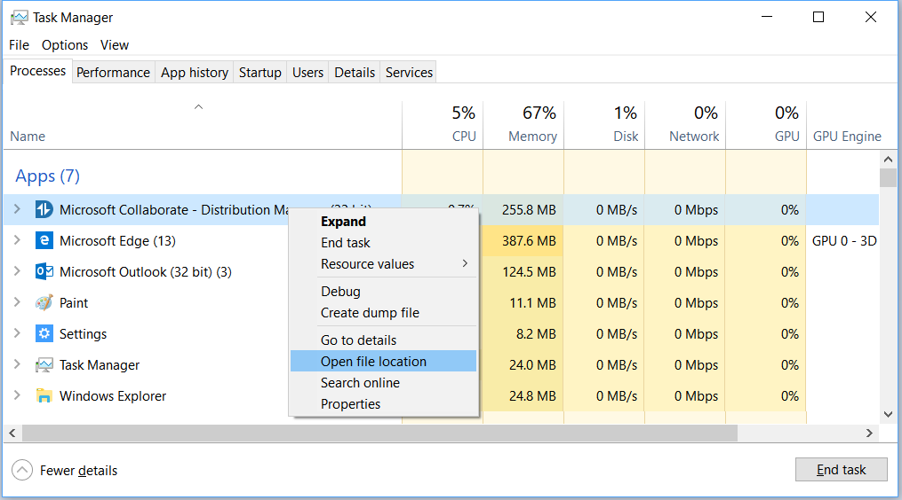
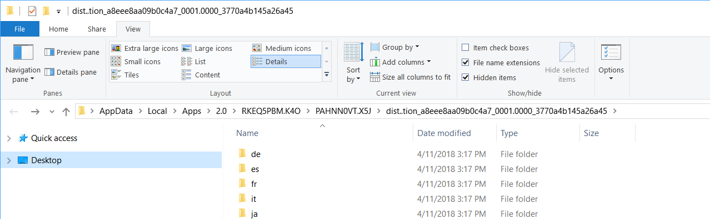
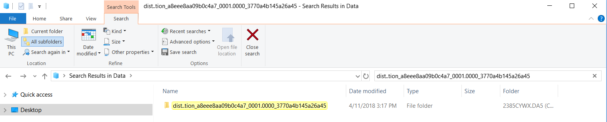

# How to Troubleshoot Common Issues
This page provides troubleshooting guides for common issues.

## Sign-in

### Microsoft Account Sign-in
If you can't sign in to Microsoft Collaborate website, try these suggestions: 
- make sure that you sign in using your complete email address
- check the status of the Microsoft account service
- make sure that you entered your password correctly. Passwords are case sensitive. If you've forgotten your password, go to the Microsoft account [reset your password](https://account.live.com/password/reset) page.
- make sure that your browser is configured to allow cookies. If your browser doesn’t allow cookies, you can’t sign in with your Microsoft account.
- try clearing your browser's cache, cookies, temporary files, and any other browsing history that is stored. Close your browser, then open a new InPrivate browsing session.

### Browser hangs or shows "page can't be displayed" error when signing in to Dev Center
After going to Dev Center/Collaborate and entering your username and password, you see one of these issues or errors:
- your browser appears to hang or become unresponsive
- you get a "page can't be displayed" error
- you get an error that says "ERR_TOO_MANY_REDIRECTS"
- you get an error that says "Hmm, we can't reach this page."
- you accept an invitation email from Dev Center and you get this message:

> You have been invited to access ... application as ... .
> However, we are not able to create this work or school account because ... is a domain that is federated with your on-premises AD.
> Please contact your admin to ensure you are properly configured in your on-premises AD and you can re-attempt to accept this invite.

#### Why this is happening
There is a good chance this is happening because your corporate email address is linked to a personal MSA/Live ID (work and personal accounts share the same name), which was a common practice with Microsoft Connect accounts. This practice is no longer supported by Microsoft and could lead to various issues. Please see [this blog post](https://cloudblogs.microsoft.com/enterprisemobility/2016/09/15/cleaning-up-the-azure-ad-and-microsoft-account-overlap/) for more details.

#### Fixes/Workarounds
The workaround is to rename your personal MSA account. See [this article](https://support.microsoft.com/en-us/help/11545/microsoft-account-rename-your-personal-account) for the detailed steps.

## Registration

### Account registration

> We could not validate your identity as a global administrator. Make sure you're able to sign in with a global administrator account for the Azure AD tenant you want to associate.

The error indicates that a user is signed in with a work account (AAD) that does not have administrator privileges. 

#### Fixes/Workarounds
Follow the [instructions](https://docs.microsoft.com/en-us/collaborate/registration) to register using Microsoft Account.

#### How to find Global Administrator for your Organization
Finding global administrator can be be a difficult task, especially if organization is big and office are located in multiple countries. 

##### Using [Azure portal](https://portal.azure.com):
1. Navigate to [Azure portal](https://portal.azure.com)
2. Select [Azure Active Directory](https://portal.azure.com/#blade/Microsoft_AAD_IAM/ActiveDirectoryMenuBlade/Overview) in the first left menu
3. Select **Roles and Administrtors** in the second left menu
4. Find **Global Administrator** role in the list and click to view members


>[!NOTE]
>
> You must sign in with your organizational account to use Azure portal.<br>

Check out these articles to learn more about **Global Administrator** role.
* [Understanding Azure identity solutions](https://docs.microsoft.com/en-us/azure/active-directory/fundamentals/understand-azure-identity-solutions#terms-to-know)
* [View members and descriptions of administrator roles in Azure Active Directory](https://docs.microsoft.com/en-us/azure/active-directory/users-groups-roles/directory-manage-roles-portal)

##### Using PowerShell
1. Launch Windows Powershell console as Administrator
2. If you have never installed Azure AD module for Powershell, execute this command
```
    Install-Module AzureAD
```
3. Execute these commands to view list of Global Administrators
```  
    Connect-AzureAD
    $role = Get-AzureADDirectoryRole | Where-Object {$_.displayName -eq 'Company Administrator'}
    Get-AzureADDirectoryRoleMember -ObjectId $role.ObjectId | Where-Object {$_.ObjectType -eq 'User'} | Get-AzureADUser
```

>[!NOTE]
>
> You must sign in with your organizational account to connect to Azure AD using PowerShell.<br>

Check out these articles to learn more about **PowerShell** and **Azure AD Module**.
* [Installing Windows PowerShell](https://docs.microsoft.com/en-us/powershell/scripting/setup/installing-windows-powershell?view=powershell-6)
* [Installing the Azure AD Module
](https://docs.microsoft.com/en-us/powershell/azure/active-directory/install-adv2?view=azureadps-2.0#installing-the-azure-ad-module)

### Invitations
If you have been invited to join Dev Center account, you need to accept the invitation before you can access Collaborate portal. If you see an error message similar to shown below, it means that you have two accounts with Microsoft using the same email address. 

> You have been invited to access ... application as ... .<br> 
> However, we are not able to create this work or school account because ... is a domain that is federated with your on-premises AD.<br> 
> Please contact your admin to ensure you are properly configured in your on-premises AD and you can re-attempt to accept this invite.<br>

The information below is intended to give you enough info to unblock yourself.
Microsoft now is limiting usage of personal Microsoft accounts linked to a work/school email address, when the email domain is configured in Azure AD. If users have configured their work accounts as sign-in names for Microsoft account MSA then they would be prevented from accessing Collaborate Portal. In this scenario, users will have to rename their personal Microsoft account, by following [these steps](http://windows.microsoft.com/en-US/Windows/rename-personal-microsoft-account/):

1. Sign in to the [Your Info page](https://account.microsoft.com/profile) of your Microsoft account.
2. Select **Manage how you sign in to Microsoft**.
3. Look under the **Account alias** section.
  * If you already have a personal email address listed there, you can skip this step.
  * If your work or school email address is the only one listed, enter your personal email address, or get a new one from Microsoft, and select **Add email** or **Add phone number**.
 4. If your personal email address does not have **(primary alias)** listed next to it, select **Make primary** to set it as your primary alias.
 5. Select **Remove** next to your work email address to remove it from your account.

Going forward, you’ll sign in to your personal Microsoft account with your personal email address. You might need to sign in again to some apps and Windows devices.

Once completed proceed with accepting the Collaborate invitations that are send from [Microsoft Invitations](mailto:invites@microsoft.com) alias.  More information about blocking the ability to create a new personal Microsoft using a work/school email address is available in this [article](https://cloudblogs.microsoft.com/enterprisemobility/2016/09/15/cleaning-up-the-azure-ad-and-microsoft-account-overlap/).

## Distribution Manager
You may receive an error message when you use Distribution Manager. This article contains information to help you troubleshoot these  error messages.

### Cannot Install Application

> Cannot continue.  The application is improperly formatted. <br>
> Contact the application vendor for assistance. <br>

This error indicates that [Microsoft .NET Framework 4.6.1 (x86/x64)](https://www.microsoft.com/en-us/download/details.aspx?id=49981)  required by Distribution Manager is not installed on your computer. All ClickOnce applications require that the correct version of the .NET Framework is installed before they can be run.

Click on the link to install [Microsoft .NET Framework 4.6.1 (x86/x64)](https://www.microsoft.com/en-us/download/details.aspx?id=49981).

### Cannot Launch Application 

> Object reference not set to an instance of an object. <br>

You may receive this error if you recently upgraded from an older version of the application.

#### Fixes/Workarounds
The workaround is to delete the click-once application data.


The exact path can be determined by the following steps:
1. Pressing **Ctrl + Alt + Del** on the keyboard and selecting Task Manager
2. Find **Microsoft Collaborate - Distribution Manager**
3. Right click and select **Open file location** from the list of options



4. This should take you to a folder like:
> %LOCALAPPDATA%\Apps\2.0\Data\xxxxxxxx.xxx\xxxxxxxx.xxx\dist..tion_xxxxxxxxxxxxxxxx_0000.0000_xxxxxxxxxxxxxxxx\Data



5. Now go to the Data path (%LOCALAPPDATA%\Apps\2.0\Data), and search for a folder with the same name 
> dist..tion_xxxxxxxxxxxxxxxx_0000.0000_xxxxxxxxxxxxxxxx\Data



6.	Delete content of the folder
7.	Restart the application

