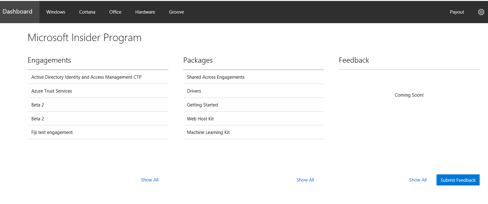
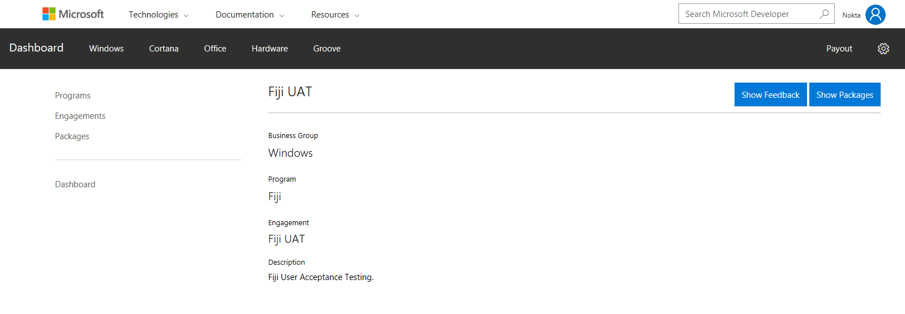

# How to view your Engagements

The **Engagements** list on your Dev Center dashboard shows the number of engagements you belong to. Click the Engagements icon to see the entire list of engagements that you belong to.

Click on any engagement to navigate to the Engagement Details page.

